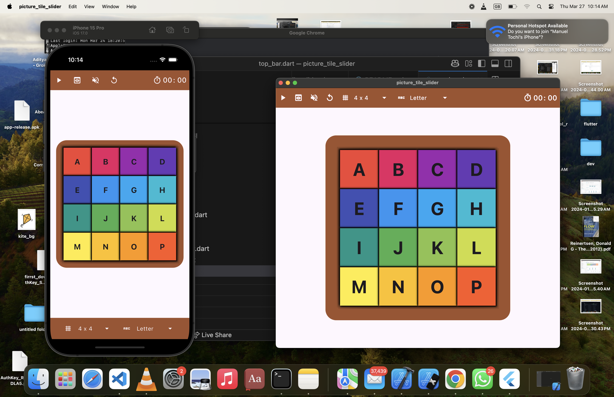

# picture_tile_slider

This was inspired by a puzzled i played as a kid, it was built during the christmas break while i have seen a kid playing with a similar one.
The aim is to build it as simple as possible, not over complicating things, with flutters in built state management. while leveraging flutter animation for smooth sliding.

## 🎮 Features

- Image Selection: Players can select custom images for the puzzle.
- Number and Letter Modes: Choose between solving puzzles with numbers or letters.
- Customizable Grid Count: Select your preferred grid size (e.g., 3x3, 4x4, etc.).
- Sound Effects: Enjoy sound feedback for tile movements and actions.
- Pause and Play Button: Pause the game anytime and resume when ready.
- Timer: Track how long it takes to complete the puzzle.
- Sliding Animation: Smooth tile sliding animations for a more realistic feel.
- Preview Picture Puzzle: Get a sneak peek of the original image to help solve the puzzle.

## 🚀 Upcoming Features

- Leaderboard: Track high scores and compete with other players.
- Theme Customization: Change the game's theme and appearance.
- Multiplayer Mode: Challenge friends and family in a timed tile-sliding competition.
- Hint System: Get hints to solve the puzzle faster.

## 📱 How to Play

1. Select a mode (Image, Number, or Letter).
2. Choose your grid size.
3. Start sliding the tiles to form the complete image or pattern.
4. Use the Pause button to take a break, and Preview to see the original image.
5. Enjoy the sound effects and animations while playing.
6. Complete the puzzle in the shortest time possible to set a record!

## 🔧 Installation Instructions

1. Clone this repository to your local machine:
   ```bash
   git clone https://github.com/ManuelAlex/picture_tile_slider.git
   ```
2. Navigate to the project directory:
   ```bash
   cd picture_tile_slider
   ```
3. Run the application:
   ```bash
   flutter run
   ```


## 🧑‍💻 Contributing

Contributions are welcome! Please follow these steps to contribute:

1. Fork the repository.
2. Create a new branch for your feature or bug fix.
3. Commit your changes.
4. Push to your forked repository.
5. Create a pull request to the main branch.

## 🛠 Technologies Used

- Flutter: For building the cross-platform application.
- Dart: The programming language used for Flutter.

## Screenshots

Here are some screenshots of the application:

### Letter Page


### Number and Image Page


## 📜 License

This project is licensed under the MIT License. See the LICENSE file for details.

## 📧 Contact

For any inquiries or feedback, please reach out to:

- Email: manuelzandr.t@gmail.com
- GitHub: ManuelAlex(https://github.com/manuelAlex)

---

Enjoy playing the Sliding Picture Tile Game! 🎉


